# 🔧 Admin Management System - DesaConnect

## 📋 Overview

Sistem admin management DesaConnect telah diperbaiki untuk menggunakan **database-only authorization**. Tidak ada lagi ketergantungan pada environment variables untuk menentukan siapa yang bisa menjadi admin.

## ✨ Key Features

### ✅ Database-Only Authorization
- **Single source of truth**: Tabel `admin_list` di Supabase
- **SuperAdmin control**: Hanya SuperAdmin yang bisa menambah/hapus admin
- **No environment variables**: Tidak bergantung pada `ALLOWED_ADMIN_EMAILS`

### ✅ Enhanced Security
- **Service role access**: Menggunakan Supabase service role untuk bypass RLS
- **Cache management**: 15-menit cache dengan auto-expiration
- **Comprehensive logging**: Detailed logs untuk debugging

### ✅ Developer Tools
- **Debug API**: Endpoint `/api/admin/debug` untuk troubleshooting
- **Cache controls**: Clear cache untuk email tertentu atau semua
- **Authorization checks**: Real-time verification tools

---

## 🚀 Admin Management Workflow

### 1. Adding New Admin (SuperAdmin Only)

**Via Admin Dashboard:**
1. Login sebagai SuperAdmin ke `/admin/login`
2. Navigate ke Admin Settings/Management section  
3. Add email yang akan dijadikan admin
4. Email tersebut sekarang bisa register sebagai admin

**Via API:**
```bash
POST /api/admin/add-admin
{
  "email": "newadmin@example.com"
}
```

### 2. Admin Registration Process

1. **User dengan email authorized** mengakses `/admin/register`
2. **System checks database**: Apakah email ada di `admin_list`
3. **If authorized**: Registration berhasil
4. **If not**: Registration ditolak dengan pesan error

### 3. Admin Login Process

1. **Authorized admin** login di `/admin/login`
2. **System verification**: Email ada di `admin_list` 
3. **Session creation**: Cookie-based admin session
4. **Dashboard access**: Full admin capabilities

**Prerequisites:** Anda harus memiliki session admin yang valid

```bash
# Pastikan Anda sudah login dan memiliki admin_session cookie
curl -X POST http://localhost:3000/api/admin/add-admin \
  -H "Content-Type: application/json" \
  -H "Cookie: admin_session=your_admin_email@domain.com" \
  -d '{"email": "admin.baru@domain.com"}'
```

### **Method 3: Environment Variables (Developer Only)**

```env
# File: .env.local
ALLOWED_ADMIN_EMAILS=existing@emails.com,admin.baru@domain.com
```

### **Method 4: Direct Database (Developer Only)**

```sql
INSERT INTO admin_list (email) VALUES ('admin.baru@domain.com');
```

---

## 👥 **Flow Registrasi Admin Baru**


---

## ✅ **Flow Registrasi yang Sudah Diperbaiki**

### **Sebelum Perbaikan (Bermasalah):**

```mermaid
graph TD
    A[SuperAdmin Add Email] --> B[Email Added to Database]
    C[Admin Register] --> D[Check Authorization]
    D --> E[Insert Email Again ❌]
    E --> F[Redundant/Error]
```


### **Setelah Perbaikan (Benar):**

```mermaid
graph TD
    A[SuperAdmin Add Email] --> B[Email Added to admin_list]
    C[Admin Register] --> D[Check isAuthorizedAdmin]
    D --> E{Email in Database?}
    E -->|✅ Ya| F[Registration Success]
    E -->|❌ Tidak| G[Registration Denied]
    F --> H[Redirect to Login]
```


### **Test Cases:**

**✅ Email yang Sudah Diauthorize:**
- `wahyumuliadisiregar@student.uir.ac.id` (SuperAdmin)
- `fatina0819@gmail.com` 
- `wahyusiregar@gmail.com`
- `test.admin@example.com`

**❌ Email yang Belum Diauthorize:**
- `random@notauthorized.com`
- `user@domain.com`

### **Verification Steps:**

1. **SuperAdmin menambah email baru:**
   ```bash
   POST /api/admin/add-admin
   Body: {"email": "newadmin@company.com"}
   ```

2. **Email langsung bisa digunakan registrasi:**
   ```bash
   POST /admin/register
   Form: {
     email: "newadmin@company.com",
     nama: "New Admin",
     password: "SecurePass123",
     phone: "081234567890"
   }
   ```

3. **Result: ✅ Registration Success**

### **Key Improvements:**
- ✅ **Removed redundant database insert** during registration
- ✅ **Clean authorization flow** dengan `isAuthorizedAdmin()`
- ✅ **No more duplicate entry errors**
- ✅ **Faster registration process**
- ✅ **Clear success/error messages**

---

## 🔐 **Sistem Otorisasi (Updated)**

### **Priority Order:**
1. **admin_session cookie** (Primary authentication)
2. **user-email cookie** (Fallback for compatibility)
3. **Environment variables** (Fastest validation)
4. **Database admin_list table** (Persistent storage)

### **API Endpoints:**

| Endpoint | Method | Purpose | Auth Required |
|----------|--------|---------|---------------|
| `/api/admin/add-admin` | POST | Tambah admin baru | ✅ Admin Session |
| `/api/admin/list-admins` | GET | Lihat daftar admin | ✅ Admin Session |
| `/api/admin/remove-admin` | POST | Hapus admin | ✅ Admin Session |

### **Fitur Keamanan:**
- ✅ Admin tidak bisa menghapus diri sendiri
- ✅ Sistem mencegah penghapusan admin terakhir
- ✅ Email validation dengan regex
- ✅ Duplicate email prevention
- ✅ Session-based authorization

---

## 📱 **Admin Dashboard Features**

### **Admin Management Tab:**
- **View All Admins:** Lihat semua admin terdaftar
- **Search Functionality:** Cari admin berdasarkan email
- **Add Single Admin:** Tambah satu admin baru
- **Batch Add Admins:** Tambah multiple admin sekaligus
- **Remove Admin:** Hapus admin dengan konfirmasi
- **Optimistic UI:** Update langsung tanpa reload

### **Batch Operations:**
```
admin1@domain.com
admin2@domain.com
admin3@domain.com
```

---

## 🎯 **Best Practices**

### **Untuk Super Admin:**
1. **Gunakan Dashboard UI** untuk menambah admin (paling mudah)
2. **Verifikasi email** sebelum menambahkan
3. **Dokumentasikan** perubahan admin
4. **Regular cleanup** admin yang tidak aktif

### **Untuk Developer:**
1. **Environment variables** untuk setup awal
2. **Database migration** untuk production deployment
3. **Backup admin list** sebelum perubahan besar
4. **Monitor logs** untuk debug authorization issues

### **Untuk Security:**
1. **Strong email validation**
2. **Regular session cleanup**
3. **Audit trail** untuk admin changes
4. **Role-based permissions** planning

---

## 🔧 **Troubleshooting**

### **Common Issues:**

**1. "Unauthorized - No user email found"**
```bash
# Solusi: Pastikan sudah login dan cookie tersedia
# Check browser cookies: admin_session atau user-email
```

**2. "Email sudah terdaftar sebagai admin"**
```bash
# Solusi: Email sudah ada di database, gunakan email lain
```

**3. "Unauthorized - Not an admin"**
```bash
# Solusi: Pastikan email Anda ada di ALLOWED_ADMIN_EMAILS atau admin_list
```

### **Debug Commands:**

```sql
-- Check current admins in database
SELECT * FROM admin_list ORDER BY created_at DESC;

-- Check specific admin
SELECT * FROM admin_list WHERE email = 'your.email@domain.com';

-- Count total admins
SELECT COUNT(*) FROM admin_list;
```

---

## 📈 **Migration dari Sistem Lama**

Jika Anda sebelumnya hanya menggunakan environment variables:

1. **Sync existing admins to database:**
```sql
-- Add existing environment admins to database
INSERT INTO admin_list (email) VALUES 
('admin1@domain.com'),
('admin2@domain.com');
```

2. **Test new API endpoints**
3. **Update admin workflow documentation**
4. **Train existing admins** on new dashboard features

---

## 🎉 **Kesimpulan**

✅ **Admin sekarang bisa menambah admin baru** melalui dashboard  
✅ **Tidak perlu akses developer** untuk manajemen admin rutin  
✅ **UI yang user-friendly** dengan validasi realtime  
✅ **API yang robust** dengan proper error handling  
✅ **Security yang maintained** dengan session validation  

**Sistem admin DesaConnect kini lebih mandiri dan scalable!** 🚀
